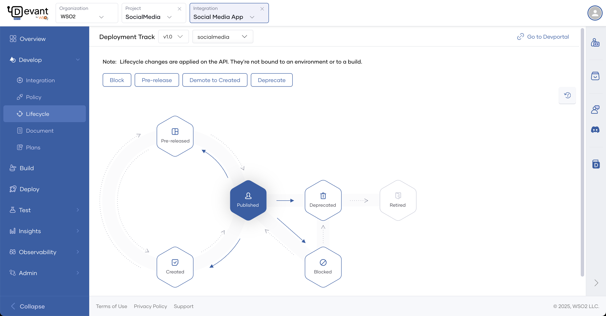

# Lifecycle Management

API lifecycle management is an important aspect of API management. The API lifecycle consists of various states that an API passes through, from creation to retirement. In Devant, there are six distinct lifecycle states: `created`, `pre-released`, `published`, `blocked`, `deprecated`, and `retired`.

By leveraging the various lifecycle states, API managers can optimize the development process and ensure that subscribers have access to the latest and most reliable APIs.

## API lifecycle states

The following lifecycle states are applicable to APIs in Devant:

| **API lifecycle state** | **Use case** | **Corresponding action** |
|-----------------------|------------|-----------|
| `CREATED` | The API is created but is not ready for consumption.| The API is not visible to subscribers in the Developer Portal.|
| `PRE-RELEASED` | A prototype is created for early promotion and consumer testing. You can deploy a new API or a new version of an existing API as a prototype to provide subscribers with an early implementation of the API.|The API is published to the Developer Portal as a pre-release.|
| `PUBLISHED` | The API is ready for subscribers to view and subscribe to via the Developer Portal| The API is visible in the Developer Portal and is available for subscription.|
| `BLOCKED` | Access to the API is temporarily blocked.| Runtime calls are blocked, and the API is not visible in the Developer Portal.|
| `DEPRECATED` | The old version of an API is moved to this state when a newer version of the API is PUBLISHED.| The API is deployed and is available to existing subscribers. New subscriptions are disabled. Existing subscribers can continue to use it as usual until the API is retired.|
| `RETIRED` | The API is no longer in use when it is in this state.| The API is unpublished and deleted from the Developer Portal.|

## Manage the lifecycle of an API

To change the lifecycle state of an API via the Devant Console, follow the instructions given below:

!!! tip
     You must have publishing privileges to manage the lifecycle states of an integration.

1. Sign in to the [Devant Console](https://console.devant.dev/).
2. Select the project.
3. In the **Integrations** pane, click on the integration for which you want to manage the lifecycle.
4. In the overview page, click **Lifecycle Status** to view the lifecycle management page.
5. You will see the lifecycle state transition diagram indicating the current lifecycle state of the integration. Just above the lifecycle state transition diagram, The possible lifecycle states you can apply to the integration are displayed just above the lifecycle state transition diagram. Click on a required lifecycle state to apply it to the integration. For example, if an integration is in the `Created` state, you can click either `Pre-release` or `Publish`.

   {.cInlineImage-full}
